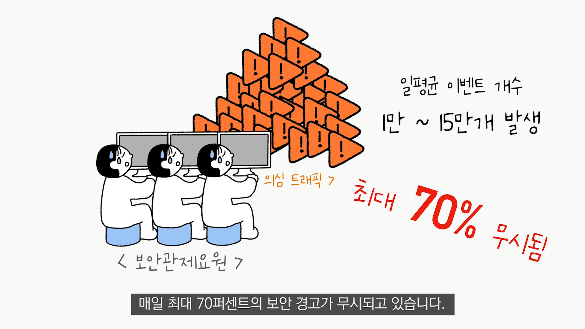

# **O24Sec** (Object-Oriented Clustering for Security Monitoring)
## 🔶 I. 프로젝트 소개
### 🔹 **산학 협력 기업** :   
### [㈜윈스](http://www.wins21.co.kr/company/company_020100.html) 
  
   
#### "세계적으로 인정받은 기술력을 가진 국가대표 정보보호기업"   

윈스는 네트워크 보안 분야에서 침입방지시스템(IPS), DDoS 공격대응솔루션, 지능형공격(APT) 대응솔루션, 통합위협관리솔루션, 방화벽에 이르기까지 시장 이슈에 따른 핵심 솔루션에서 각각 우위를 기록하며 보안기술과 시장을 선도하고 있습니다. 2003년부터 2004년까지는 당시 네트워크 보안의 대표 솔루션인 침입탐지시스템(IDS)으로 보안시장에 성공적으로 안착했고 2005년과 2010년 개발ㆍ공급된 침입방지시스템(IPS)과 DDoS차단시스템까지 잇따라 국내 시장점유율 1위를 차지하며 현재까지 네트워크 정보보호 업계 선두를 달리고 있습니다.   
 

### 🔹 산학 협력 주제 : **(주)윈스 [SNIPER BD1](http://www.wins21.co.kr/product/product_030101.html?num=27) 보안관제제품 오탐(False Positive) 제거** 
   - **산학 요구 기술:**   
      - **데이터 기반 알고리즘 개발**
      - **부정확한 라벨 한계 극복**    
 

### 🔹 팀 "멜리러를 찾아서"의 제안기술 : **객체 중심의 보안관제로그 오탐제거**   
  1. 암호화/비암호화 데이터 구별
  2. 보호대상의 객체 식별(클라이언트/서버, 내부장비/외부대상)
  3. 객체 중심의 오탐 제거   
 

### 🔹 프로젝트명 : **O24Sec (Object-Oriented Clustering for Security Monitoring)**   
윈스의 보안관제제품 SNIPER BD1에서는 24시간 공격에 대응할 수 있는 실시간 모니터링, 위협 감시, 데이터 수집, 분석 보고서 등 빠르게 침해사고에 대응할 수 있는 통합보안관제시스템을 제공해 주고 있다. 하지만 소수의 보안관제 인력, 정보화 시대에 따른 방대한 양의 네트워크 트래픽 등의 제한사항에 윈스는 AI보안을 통해 보안관제에 효율성을 높히고 있다. 하지만 AI보안 모델 생성시 기존의 라벨링 되어 있는 학습데이터가 부정확하거나 일관성이 없을 경우 만들어진 보안 모델의 정확도는 떨어질 수 밖에 없다. **즉, 같은 모델이라도 학습되는 데이터가 일관적이고 정확도가 높다면 모델의 성능은 비약적으로 올라갈 수 있기때문에 우리는 이 학습데이터에서 객체 중심의 분석을 통해 잘못된 라벨링을 찾아 교정하여 더 좋은 성능의 모델을 만들고자 한다.**   
 
 

## 🔶 II. Abstract   
   
Wins' security monitoring product, SNIPER BD1 provides an integrated security control system. However, due to limitations such as a small number of security monitoring person and a huge amount of network traffic due to the information society, Wins is increasing the efficiency of security control through AI security. However, when the AI security model is created, if the existing labeled training data is inaccurate or inconsistent, the accuracy of the created security model will inevitably decrease. In other words, even with the same model, if the trained data is consistent and accurate, the performance of the model can increase drastically. Therefore, we want to make a better model by finding and correcting incorrect labeling through object-oriented clustering in this training data.
 
 

### 🔶 III. 소개 영상

 
 
   
### 🔶 IV. 팀 소개
   
### 🔹 지도 교수님

~~~
윤명근 교수님
캡스톤 디자인 프로젝트 지도교수님
프로젝트 검수
mkyoon@kookmin.ac.kr
~~~

 

### 🔹 '멜러리를 찾아서' 팀원 소개

#### 장우혁 ([@spectator05](https://www.github.com/spectator05))

~~~
Role : (정) 보호대상 객체식별 기술 개발   
       (부) 암호-비암호 구별 기술 개발   
       (공통) 객체 별 유사도 실험, 클러스터링 기법 실험   
E-Mail : spector@kookmin.ac.kr
~~~
   
   
   
#### 김민송 ([@MinSong1227](https://github.com/MinSong1227))

~~~
Role : (정) 암호-비암호 구별 기술 개발   
       (부) 보호대상 객체식별 기술 개발   
       (공통) 객체 별 유사도 실험, 클러스터링 기법 실험   
E-Mail : alsthd14@kookmin.ac.kr
~~~
   
 
 

## 🔶 V. 사용법   
### /object_separating   
`$ python main.py <data_path> <save_path>`

#### input :   
- data_path : IPS 데이터들(pickle 파일)이 존재하는 폴더 경로   
- save_path : 최종 csv결과를 저장할 경로   
   
#### return : 
- save_path/encrypt/ : encryption events with category(0 ~ 3 : inner-outer, server-client)
- save_path/plain/ : unencryption events with category(0 ~ 3 : inner-outer, server-client) 
- save_path/{object}_result.csv : The Result of clustered events   

 
 

### 🔶 VI. 기타

